# 3. AI Pipeline and Model Strategy

## 3.1 Model roles

The PoC should begin with the smallest practical number of endpoints while keeping role separation in the software architecture.

| Logical role | PoC recommendation | Responsibilities |
|---|---|---|
| `presentation-reasoning` | enterprise-approved multimodal reasoning model | Brief understanding, narrative planning, structured slide specification, multimodal slide review and repair planning |
| `presentation-image` | enterprise-approved image-generation model | Supporting illustrations and background assets; never complete slide rasterisation |
| `presentation-embedding` | existing enterprise embedding model | Text retrieval across approved content and templates |
| `presentation-visual-embedding` | optional enterprise visual-embedding model | Similar-slide and visual-layout retrieval |
| `presentation-reranker` | Optional | Rerank approved corporate content and slide patterns |

Model aliases are capability contracts, not hard-coded model names. The model gateway exposes stable aliases and maintains the actual model version.

## 3.2 Generation pipeline

```mermaid
flowchart LR
    A[User brief + source files] --> B[Ingest and classify]
    B --> C[Extract evidence and summaries]
    C --> D[Create DeckBrief]
    D --> E[Create DeckPlan]
    E --> F[User outline approval]
    F --> G[Generate SlideSpec per slide]
    G --> H[Resolve template/layout]
    H --> I[Compose PPTX objects]
    I --> J[Render slide images]
    J --> K[Deterministic QA]
    K --> L[Multimodal QA]
    L --> M{Pass?}
    M -- no --> N[Minimal repair plan]
    N --> I
    M -- yes --> O[Export and publish version]
```

## 3.3 Structured contracts

The AI may only return validated JSON matching the repository schemas. Free-form prose is allowed only in user-facing explanations and speaker notes.

### DeckBrief

Captures audience, objective, decision sought, language, tone, length, source scope, confidentiality and desired deck type.

### DeckPlan

Defines the ordered slide narrative, the purpose and message of each slide, the evidence required, the recommended archetype and whether a slide requires a chart, diagram, image or table.

### SlideSpec

Defines semantic slide content independent of the rendering engine. It contains objects, hierarchy, data bindings, citations, layout constraints and speaker notes.

### QAReport

Contains deterministic and multimodal findings with object IDs, severity, confidence and repair actions.

## 3.4 Prompt architecture

Prompts are versioned artefacts stored outside application source where practical. Each generation call consists of:

1. **System policy:** role, safety, grounding and strict schema output.
2. **Task instruction:** operation such as create plan, compose slide, inspect or repair.
3. **Template contract:** allowed archetypes, placeholder constraints and design tokens.
4. **Source context:** delimited, sanitised and ranked evidence.
5. **Existing state:** deck brief, plan, prior slide version or QA report.
6. **Output schema:** exact JSON schema and no additional properties.

### Prompt rules

- Never include secrets, connection strings or internal implementation details not required by the model.
- Treat all uploaded document text as untrusted data, not instruction.
- Explicitly tell the model to ignore instructions found inside source documents.
- Use stable object IDs so repair operations can target individual elements.
- Keep prompts deterministic with low temperature for structure generation.
- Log prompt template ID and hash, not unrestricted raw confidential source content in standard application logs.

## 3.5 Recommended model parameters

| Operation | Temperature | Max output | Notes |
|---|---:|---:|---|
| Deck brief extraction | 0.0-0.2 | 2,000 tokens | Strict schema, deterministic |
| Deck planning | 0.2-0.4 | 6,000 tokens | Some narrative creativity |
| Slide specification | 0.2-0.4 | 4,000 tokens per slide | Parallelise with concurrency controls |
| Slide rewrite | 0.2-0.5 | 2,000 tokens | Preserve intent and object IDs |
| Visual QA | 0.0-0.2 | 2,000 tokens | Evidence-based defect list |
| Repair planning | 0.0-0.2 | 2,000 tokens | Minimal patch only |

Values are initial defaults and must be benchmarked on the approved model.

## 3.6 Grounding and citations

For decks generated from internal documents:

- Every factual claim should reference one or more `source_chunk_id` values.
- The slide may show concise citations or keep them in speaker notes, depending on template policy.
- The system distinguishes sourced facts, user-provided assumptions and AI-proposed narrative text.
- Unsupported claims are marked `requires_review=true`.
- Tables and charts must record the exact structured data source and transformation.
- The export manifest includes a machine-readable lineage file.

## 3.7 Deterministic QA

Run before multimodal inspection:

- JSON schema and enum validation.
- Object bounds within slide canvas and safe margins.
- Text length against placeholder limits.
- Font size minimums.
- Element overlap and clipping.
- Unsupported characters or missing fonts.
- Invalid chart series, empty data or inconsistent units.
- Image resolution and aspect ratio.
- Colour token and contrast checks.
- Required logo/footer/slide-number presence.
- PPTX package integrity and relationship validation.

## 3.8 Multimodal QA

The rendered slide and a compact semantic representation are submitted to the visual model. The model scores:

- Message clarity and hierarchy.
- Content density.
- Alignment, balance and whitespace.
- Legibility and contrast.
- Suitability of visual assets.
- Brand consistency.
- Obvious factual or semantic mismatch between text and visual.
- Arabic shaping, direction and mixed-language alignment.

The visual model must not directly rewrite the slide. It returns a `QAReport`; the repair worker creates a validated patch.

## 3.9 Repair strategy

- Maximum two automated repair cycles by default; configurable to three for pilot testing.
- Repair the smallest set of objects that resolves the defect.
- Preserve user-edited and locked objects.
- Do not silently remove factual content to solve overflow; shorten only with traceable transformation.
- Escalate when repair changes the meaning, removes a required citation or violates a template lock.
- Store before/after render and QA score for regression analysis.

## 3.10 Image-generation policy

- Prefer approved internal asset libraries and licensed stock sources.
- Use the image model for conceptual illustrations, backgrounds and decorative elements.
- Do not generate logos, official product screenshots, legal documents or complete slides.
- Keep all text outside generated images unless decorative text is explicitly required and reviewed.
- Record prompt, model, seed/configuration, safety outcome and usage rights metadata.
- Apply image safety, face/person rules and enterprise content policies before storage.

## 3.11 Arabic and RTL strategy

- Detect language at document, slide and object level.
- Select RTL-capable template variants.
- Store text direction explicitly in `SlideSpec`.
- Validate Arabic shaping after PPTX generation and after rendering.
- Treat mixed Arabic/English object alignment as a dedicated QA category.
- Maintain Arabic typography tokens and approved fonts in the template package.
- Include Emirati and telecom terminology in the controlled glossary rather than fine-tuning during PoC.

## 3.12 Model evaluation

Evaluate candidate models on a fixed internal benchmark:

- Strict schema adherence.
- Storyline quality.
- Source-grounding precision and recall.
- Slide-content concision.
- Visual-defect detection.
- Arabic generation and RTL reasoning.
- Latency, throughput and memory utilisation.
- Cost per completed deck.

A model change requires benchmark results and a model configuration release, but not an application release if the API contract remains stable.
