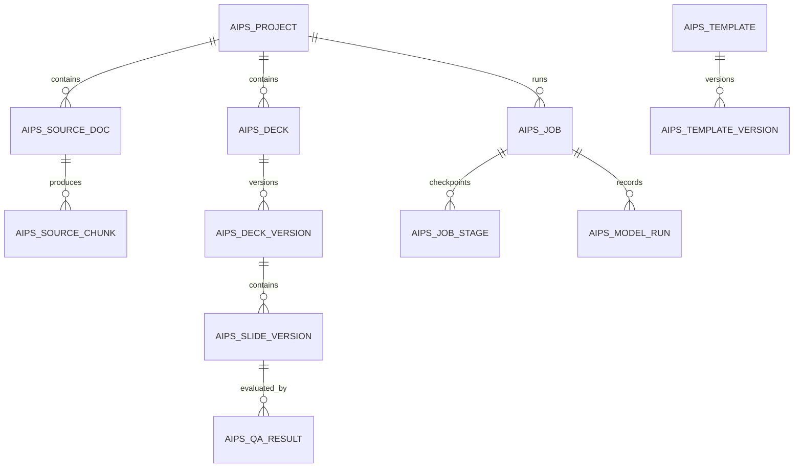

# 4. Data Model and Storage

## 4.1 Storage principles

- Oracle stores queryable metadata, state, JSON specifications, lineage and audit.
- Object storage holds binary and large derived artefacts.
- Redis holds ephemeral queue/event state only; it is not the system of record.
- Deck and slide versions are immutable. A user edit creates a new version.
- Deletion follows a controlled soft-delete and purge workflow.

## 4.2 Proposed Oracle schema

Use prefix `AIPS_` unless enterprise naming standards require another prefix.

| Table | Purpose | Key columns |
|---|---|---|
| `AIPS_PROJECT` | User project and access scope | `PROJECT_ID`, `OWNER_ID`, `TEAM_ID`, `TITLE`, `CLASSIFICATION`, `STATUS` |
| `AIPS_SOURCE_DOC` | Uploaded source metadata | `SOURCE_ID`, `PROJECT_ID`, `OBJECT_URI`, `SHA256`, `MIME_TYPE`, `SCAN_STATUS` |
| `AIPS_SOURCE_CHUNK` | Extracted and grounded source chunks | `CHUNK_ID`, `SOURCE_ID`, `PAGE_NO`, `SECTION_PATH`, `TEXT`, `VECTOR` optional |
| `AIPS_DECK` | Logical presentation | `DECK_ID`, `PROJECT_ID`, `CURRENT_VERSION_ID`, `TEMPLATE_ID` |
| `AIPS_DECK_VERSION` | Immutable generated or edited deck version | `VERSION_ID`, `DECK_ID`, `PARENT_VERSION_ID`, `STATUS`, `PPTX_URI`, `PDF_URI` |
| `AIPS_SLIDE_VERSION` | Immutable semantic slide version | `SLIDE_VERSION_ID`, `VERSION_ID`, `SLIDE_NO`, `SLIDE_SPEC_JSON`, `RENDER_URI`, `QA_SCORE` |
| `AIPS_TEMPLATE` | Template identity and lifecycle | `TEMPLATE_ID`, `NAME`, `OWNER_TEAM`, `STATUS`, `CURRENT_VERSION_ID` |
| `AIPS_TEMPLATE_VERSION` | Template package version | `TEMPLATE_VERSION_ID`, `MANIFEST_JSON`, `PACKAGE_URI`, `COMPATIBILITY` |
| `AIPS_ASSET` | Images, icons and generated assets | `ASSET_ID`, `PROJECT_ID`, `TYPE`, `OBJECT_URI`, `LICENSE_METADATA_JSON` |
| `AIPS_JOB` | Durable job state | `JOB_ID`, `PROJECT_ID`, `TYPE`, `STATUS`, `CURRENT_STAGE`, `PROGRESS` |
| `AIPS_JOB_STAGE` | Stage attempts and checkpoints | `STAGE_ID`, `JOB_ID`, `NAME`, `ATTEMPT_NO`, `STARTED_AT`, `ENDED_AT`, `ERROR_CODE` |
| `AIPS_MODEL_RUN` | Model call lineage | `RUN_ID`, `JOB_ID`, `MODEL_ALIAS`, `MODEL_VERSION`, `PROMPT_VERSION`, `TOKEN_USAGE` |
| `AIPS_QA_RESULT` | QA reports and defects | `QA_ID`, `SLIDE_VERSION_ID`, `QA_TYPE`, `SCORE`, `REPORT_JSON` |
| `AIPS_AUDIT_EVENT` | Immutable user/admin audit | `EVENT_ID`, `ACTOR_ID`, `ACTION`, `RESOURCE_TYPE`, `RESOURCE_ID`, `EVENT_TS` |
| `AIPS_IDEMPOTENCY` | Request replay protection | `KEY_HASH`, `ACTOR_ID`, `REQUEST_HASH`, `RESPONSE_RESOURCE_ID`, `EXPIRES_AT` |

## 4.3 Core relationships



## 4.4 Object storage layout

```text
/aips/{environment}/
  projects/{project_id}/
    sources/{source_id}/original/{filename}
    sources/{source_id}/extracted/{extract_version}.json
    assets/{asset_id}/{variant}
    decks/{deck_id}/versions/{version_id}/deck.pptx
    decks/{deck_id}/versions/{version_id}/deck.pdf
    decks/{deck_id}/versions/{version_id}/manifest.json
    decks/{deck_id}/versions/{version_id}/slides/{slide_no}/render.png
    decks/{deck_id}/versions/{version_id}/slides/{slide_no}/thumbnail.webp
  templates/{template_id}/versions/{template_version_id}/package.zip
  temporary/{job_id}/...
```

Temporary artefacts receive short retention and are purged automatically after completion or failure.

## 4.5 Versioning semantics

- `Deck` is the logical document.
- `DeckVersion` is a complete immutable snapshot.
- `SlideVersion` belongs to exactly one deck version.
- Regenerating one slide creates a new complete deck version referencing unchanged slide specifications by content hash or copying metadata as appropriate.
- Template and prompt versions are captured in the deck version manifest.
- Exports are reproducible only when all referenced provider versions remain available; otherwise the existing artefact remains authoritative.

## 4.6 Classification and retention

Proposed classification values:

- `PUBLIC`
- `INTERNAL`
- `CONFIDENTIAL`
- `RESTRICTED`

Policies are inherited from the strictest source document. The user cannot lower classification without an authorised workflow.

Retention defaults are enterprise-policy driven. Suggested implementation:

- Temporary working files: 7 days.
- Failed job artefacts: 14 days unless held for investigation.
- Projects and versions: owner-selected within policy bounds.
- Audit events: enterprise mandatory period.
- Model prompts containing source content: store encrypted and access-controlled only when approved; otherwise store hashes, metadata and minimal redacted traces.

## 4.7 Idempotency and concurrency

- Mutating API requests accept `Idempotency-Key`.
- The key is scoped to actor and endpoint and stored with a request hash.
- Editing uses optimistic concurrency through `If-Match` and a deck-version ETag.
- A project can have multiple read operations but only controlled concurrent mutation jobs.
- Template publication uses a database lock or compare-and-set on the current version.

## 4.8 Data integrity

- SHA-256 calculated for every uploaded and generated binary.
- MIME type determined by content, not filename.
- PPTX ZIP package validated before publication.
- Object-store writes use temporary keys and atomic finalisation.
- Database records and object references are reconciled by a scheduled integrity job.
- All timestamps use UTC; user-facing display uses Asia/Dubai by default.
