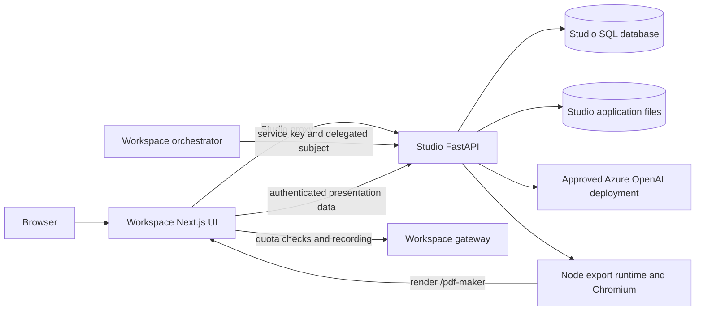

# Presentation Studio architecture

This reference describes the Studio backend in the current working tree, reviewed on 2026-09-29. The [Workspace architecture](../../GenAI-Workspace/docs/architecture.md) covers the complete product; [database architecture](../../GenAI-Workspace/docs/database.md), [developer setup](../../GenAI-Workspace/docs/developer-setup.md) and [configuration ownership](../../GenAI-Workspace/docs/configuration.md) cover the shared environment. Unfinished safeguards and recommendations are identified explicitly below.

## Scope and boundaries

Studio generates, edits, stores and exports presentations. FastAPI lives in this repository. All user screens live in `GenAI-Workspace-UI/src/features/studio`, mounted at `/app/studio/*`. There is no standalone Studio frontend, local-login surface, provider-settings dashboard or durable background-job service.

The supported generation path is Smart HTML. TemplateV2 generation routes and template-management tables are retired. Historical migrations and legacy columns remain necessary for upgrading existing databases; their presence does not make those features supported.



Workspace owns chat offers, handoff references and quotas. Studio owns presentations, slides, generation feedback and assets. There is no cross-database foreign key or distributed transaction. Workspace Admin inference settings do **not** reconfigure Studio: Studio reads its own process configuration.

| Component | Responsibility and source |
|---|---|
| API and authentication | [Application](../servers/fastapi/api/main.py), [middleware](../servers/fastapi/api/middlewares.py), [principal resolution](../servers/fastapi/api/v1/auth/principal.py) |
| Database | [Engine and ownership scope](../servers/fastapi/services/database.py), [models](../servers/fastapi/models/sql), [migrations](../servers/fastapi/alembic/versions) |
| Generation | [Presentation endpoints](../servers/fastapi/api/v1/ppt/endpoints/presentation.py), [Smart generation and repair](../servers/fastapi/utils/llm_calls/generate_smart_presentation.py) |
| Extraction | [LiteParse service](../servers/fastapi/services/liteparse_service.py), [Node runner](../resources/document-extraction/liteparse_runner.mjs) |
| Export | [Coordinator](../servers/fastapi/utils/export_utils.py), [subprocess service](../servers/fastapi/services/export_task_service.py), [runtime installer](../scripts/sync-presentation-export.cjs) |
| Browser integration | [Studio proxy](../../GenAI-Workspace-UI/src/lib/studio-proxy.ts), [Studio shell](../../GenAI-Workspace-UI/src/features/studio/StudioShell.tsx), [quota bridge](../../GenAI-Workspace-UI/src/lib/studio-quota.ts) |

## Identity and trust

The browser calls `/api/studio/*` on the Workspace UI. Its Node route handler forwards bodies, SSE, images and downloads directly to FastAPI. Set the UI's server-only `FAST_API_INTERNAL_URL` explicitly. The resolver still has legacy `NEXT_PUBLIC_FAST_API` and loopback fallbacks; do not rely on these in deployment.

Studio supports two authenticated principals:

- A Workspace HS256 JWT in a bearer header or `studio_token` cookie. `WORKSPACE_JWT_SECRET` must match the Workspace issuer. `exp` and `sub` are required. Issuer/audience checks apply only when `WORKSPACE_JWT_ISSUER` and `WORKSPACE_JWT_AUDIENCE` are configured consistently with issued tokens.
- A bearer `STUDIO_SERVICE_API_KEY`, matched to Workspace's `PRESENTATION_STUDIO_API_KEY`. With `X-On-Behalf-Of`, it delegates to that Workspace subject. Without the header, it can access only `/api/v1/admin/*`. Workspace user JWTs, including administrators' JWTs, cannot access Studio's service-admin surface.

[Identity mapping](../servers/fastapi/api/v1/auth/workspace_jwt.py) creates a `GENAI_WORKSPACE_STUDIO_USER` row on first use, keyed by the lowercased JWT `sub` in `external_subject`, never by a local username. This provides user ownership in one trusted Workspace identity namespace, **not organization-based tenancy**. Multiple issuers/organizations must not share ambiguous subjects until identity is namespaced in code.

Workspace stores the access token in browser storage and mirrors it to an HttpOnly, SameSite=Lax cookie for Studio assets, EventSource and downloads. The mirror does not remove the browser-readable original token. The proxy forwards only the Studio cookie and caller authorization. Backend signature verification, rather than the UI login gate, is the security boundary.

During an authenticated request, context variables carry the owner. SQLAlchemy hooks constrain ORM SELECTs and stamp new owned rows. Raw SQL, bulk updates and deletes must explicitly enforce owner conditions. Foreign keys preserve relationships; they do not provide row-level authorization.

[Asset authorization](../servers/fastapi/api/v1/auth/assets.py) protects `/app_data/images|uploads|exports|pptx-to-html|pptx-to-json/users/<owner UUID>/...`, rejects traversal and rejects unknown private roots. Fonts/templates and `/static` are public. Keep application files behind Studio; serving the same volume through an unauthenticated web server bypasses ownership checks.

`DISABLE_AUTH=true` currently bypasses authentication without checking the environment. Restrict it to isolated loopback development with disposable data. Such rows have null owners and are not automatically assigned when authentication is enabled.

## API and user flows

The exact method/path contract lives in [test_route_contract.py](../servers/fastapi/tests/unit/test_route_contract.py). OpenAPI is generated from code. When authentication is enabled, `/docs`, `/redoc` and `/openapi.json` are protected. Maintain the route test and clients together instead of duplicating the full route inventory here.

| Flow | API group under `/api/v1/ppt` |
|---|---|
| Source upload and extraction | `/files/upload`, `/files/decompose`, `/template/extract-color-palette` |
| Outline | `/presentation/create`, `/outlines/stream/{id}`, `/outlines/{id}`, quality-flag acknowledgment |
| Deck generation/editor | `/presentation/stream/{id}`, `/presentation/{id}`, `/presentation/update`, `/presentation/slide_update`, `/slide/edit-html` |
| Library | `/presentation/all`, delete, duplicate and favorite operations |
| Media | `/images/*`, `/icons/search` |
| Presentation chat | `/chat/conversations`, `/chat/history`, `/chat/conversation`, `/chat/message/stream` |
| Feedback | `/feedback/{presentation_id}` and stage updates; service-admin export at `/api/v1/admin/feedback` |
| Export | `/presentation/{id}/export`, chart/table capture endpoints |

1. The user supplies a brief and optional files/reference palette. Studio persists an outline draft, generates the outline and records source-quality flags.
2. The user reviews the outline and acknowledges retained static visuals. Outline chat can revise this draft. The current Workspace deck editor does not mount the deck-chat component, although the backend supports deck-chat tools.
3. Approval creates a new Smart presentation linked by `source_presentation_id`. Both the standard-branded and e& choices use Smart HTML. Persisted `generation_mode="standard"` identifies an outline draft, not an active TemplateV2 generation path.
4. Generation streams accepted slide fragments and saves progress before marking the deck complete. Manual editing updates stored HTML and editor data.
5. Export renders the saved deck through the Workspace `/pdf-maker` page. Feedback references the particular outline/deck generation, not only the mutable presentation ID.

The UI proxy authorizes a presentation quota before creation and records usage after success. Chat handoffs use orchestrator quota rules. These are not transactional with Studio creation, and post-create recording is best effort. Direct Studio calls have no independent Workspace quota enforcement. Keep direct ingress private and reconcile usage when recording fails.

## Generation and browser rendering

`GENAI_WORKSPACE_SLIDE.html_content` stores Tailwind HTML for a 1280 × 720 slide, alongside structured content, speaker notes and editor properties. [Presentation constants](../servers/fastapi/constants/presentation.py) cap requested content at 40 slides and outline content at 300 words per slide. e& adds a fixed cover and closing slide. Automatic slide selection has a separate, smaller limit; do not infer input limits from totals that already include brand slides.

Outline-driven decks above 20 content slides use 10-slide chunks. The first establishes style; later chunks can run concurrently. Shorter or outline-free generation uses one stream. Invalid slides receive bounded repair and real-browser layout checks; valid contiguous progress is retained. Fixed e& markup comes from [brand templates](../servers/fastapi/utils/smart_brand_templates.py), outside generated content.

Database sessions are short-lived around units of work. `generation_status="in_progress"` and saved slides support resume after interrupted requests. Completion replaces the saved slide set and rotates `deck_generation_id`; outline completion rotates `outline_generation_id`. Manual edits do not rotate these feedback identifiers.

Generation is an in-process asynchronous task attached to an HTTP stream. It is cancelled when the stream unwinds; later requests resume persisted progress. There is no durable queue, distributed lease or per-deck generation lock. Avoid simultaneous generation requests for the same deck. The status field alone is not mutual exclusion.

Outline streaming persists the `has_explicit_slide_structure` decision with the
completed outline. Repeated requests reuse it even after `n_slides` is backfilled;
an explicit user-supplied slide count remains authoritative. Preserve the
[repeat-call regression tests](../servers/fastapi/tests/integration/test_outlines_endpoint.py)
when changing detection or resume behavior. This stable decision does not provide
a general idempotency guarantee for generation requests.

The UI currently has different rendering paths:

- [SmartHtmlSlide](../../GenAI-Workspace-UI/src/features/studio/app/%28presentation-generator%29/components/SmartHtmlSlide.tsx) defaults to a sandboxed `allow-scripts` iframe. The legacy `NEXT_PUBLIC_PRESENTON_ELECTRON_PLATFORM=linux` flag selects sanitized in-page markup plus chart-script injection.
- [SmartHtmlEditor](../../GenAI-Workspace-UI/src/features/studio/app/%28presentation-generator%29/components/SmartHtmlEditor.tsx) inserts HTML directly into the editor DOM and persists edits through Redux/API calls.
- [Chart injection](../../GenAI-Workspace-UI/src/features/studio/app/%28presentation-generator%29/components/useSmartChartInjection.ts) executes scripts extracted from original slide HTML. Its scoped-document wrapper is a rendering convenience, not a security sandbox.
- The export page renders outside Workspace's navigation/auth shell.

Do not describe all slide HTML as sanitized or isolated. Generated HTML/scripts and media/font URLs are active content. A common sanitizer, isolated rendering origin and declarative chart data are recommended before accepting arbitrary untrusted HTML. Validate layout in Chromium; static checks cannot establish overflow or export fidelity.

## Database and files

Studio uses SQLModel/SQLAlchemy and Alembic in a separate database from Workspace
chat. All active Studio application tables use `GENAI_WORKSPACE_` because Studio
is integrated into Workspace; `GENAI_PRESENT_` is reserved for an unrelated
standalone presentation product. The shared prefix does not merge schemas or
transactions. Studio still has no implemented Oracle driver path, and installing
Oracle for Workspace does not move Studio data.

| Database choice | Current implementation |
|---|---|
| SQLite | Without `DATABASE_URL`, selects `<APP_DATA_DIRECTORY>/fastapi.db`, or `/tmp/presenton/fastapi.db` when that directory is unset. The example explicitly chooses `./app_data/studio.db`. Relative paths resolve from the process working directory. |
| PostgreSQL | `postgresql://...` becomes asyncpg at runtime; Alembic uses psycopg. Pool configuration is supported. This is a candidate for a separately validated shared deployment. |
| MySQL | `mysql://...` becomes aiomysql at runtime; Alembic uses PyMySQL. Driver support does not establish migration/workload qualification. |

Use absolute storage paths, an explicit database URL and separate databases/credentials per environment. Existing migration and ownership integration tests mainly use SQLite. Validate migrations, foreign keys and representative concurrency on the chosen server database before cutover. [URL conversion](../servers/fastapi/utils/db_utils.py) removes query parameters after handling PostgreSQL `sslmode`; arbitrary driver/TLS query options are not preserved.

### Active tables

| Table | Purpose and relationships |
|---|---|
| `GENAI_WORKSPACE_STUDIO_USER` | Internal UUID and unique Workspace `external_subject`. Password/admin columns remain for schema compatibility; no local-login routes are active. |
| `GENAI_WORKSPACE_PRESENTATION` | Owner, brief, outline JSON, mode/status, brand settings, quality flags, favorite and generation IDs. `source_presentation_id` references another presentation with `ON DELETE SET NULL`. |
| `GENAI_WORKSPACE_SLIDE` | Owner, indexed presentation reference, order, HTML, content, notes and editor properties. Presentation deletion cascades. |
| `GENAI_WORKSPACE_STUDIO_CHAT_MESSAGE` | Owner, presentation/conversation reference, position, content and tool calls. Presentation deletion cascades. |
| `GENAI_WORKSPACE_IMAGE_ASSET` | Owner, file path, upload/generated flag and metadata. Binary data is on disk. |
| `GENAI_WORKSPACE_STUDIO_FEEDBACK` | Owner, presentation, stage, generation ID, rating/reasons/comment and context. Unique owner/presentation/stage/generation tuple. Presentation deletion sets its reference null, preserving feedback; user deletion cascades. |
| `GENAI_WORKSPACE_STUDIO_SCHEMA_VERSION` | Applied revision for databases managed through Alembic. |

The [models](../servers/fastapi/models/sql) define the current schema; [migration scripts](../servers/fastapi/alembic/versions) define upgrades. JSON storage depends on the dialect. There is no separately maintained Studio SQL bootstrap dump: use Alembic. Workspace Oracle SQL belongs in the [central database guide](../../GenAI-Workspace/docs/database.md), not in Studio's database.

Studio's uppercase table identifiers are quoted by SQLAlchemy. Quote them in
manual PostgreSQL queries too, for example
`SELECT count(*) FROM "GENAI_WORKSPACE_PRESENTATION"`; an unquoted identifier
is folded to lowercase and refers to a different object.

### Migrations and ownership cutover

The current head is `f8c2d4e6a0b3`, the canonical Workspace table-name migration,
after `e7b1d3f5a9c2` (per-deck web-search mode). Key milestones are:

- [Workspace table naming](../servers/fastapi/alembic/versions/f8c2d4e6a0b3_workspace_table_names.py).
- [Workspace identity/favorites](../servers/fastapi/alembic/versions/a1f0c2d4e6b8_workspace_identity_and_favorites.py).
- [Generation feedback](../servers/fastapi/alembic/versions/b7d3e9f1a2c4_generation_feedback.py) and [outline/deck linkage](../servers/fastapi/alembic/versions/c4e6a8b0d2f3_source_presentation_id.py).
- [Retired-table removal](../servers/fastapi/alembic/versions/d5f7b9c1e3a4_drop_upstream_standalone_tables.py), which drops old template, provider, token and async-task tables. Downgrading recreates empty structures; it cannot recover deleted rows.

The rename maps `user`, `presentations`, `slides`, `imageasset`,
`chat_history_messages` and `generation_feedback` to the six prefixed application
tables above without copying or deleting rows. It preflights old/new collisions
before renaming and retains existing index/constraint names. SQLite requires
3.26 or newer, `legacy_alter_table` disabled and valid foreign keys. Its upgrade
runs the tracker and application renames in one transaction. MySQL uses one
`RENAME TABLE` statement for the six application tables, but tracker DDL commits
separately. A failed MySQL application-table preflight can therefore leave the
canonical tracker holding the unchanged prior revision; resolve the reported
collision and retry with the updated migration tooling.
Fresh Alembic installations finish with the same canonical names;
no active layout/version tables are introduced.

Online upgrade/downgrade/stamp also transitions the legacy `alembic_version`
tracker to `GENAI_WORKSPACE_STUDIO_SCHEMA_VERSION` before revision discovery.
If both tracker names exist, investigate the collision rather than merging them.
`heads` reads scripts without connecting; `current` inspects the selected database
without renaming its legacy tracker. Downgrade reverses application-table names,
but the tracker remains canonical so Alembic can safely record the prior revision.
This means a code rollback still needs a compatible migration environment; do not
assume old binaries can read the new tracker.

With `MIGRATE_DATABASE_ON_STARTUP=true`, [startup](../servers/fastapi/api/lifespan.py) invokes [migrations.py](../servers/fastapi/migrations.py). Otherwise [schema validation](../servers/fastapi/utils/schema_names.py) rejects legacy or mixed names, incomplete canonical schemas, conflicting views and missing model columns before `create_all`. A fresh empty database can receive current tables, but `create_all` neither upgrades existing columns nor stamps revisions. It is not an upgrade strategy. Startup migrations also infer/restamp some legacy or unknown revisions; inspect that behavior on a restored copy before applying it to an old or divergent database.

For controlled deployments, stop writers, back up the database **and application files**, migrate once, verify the revision and start the service. Do not have every replica race to migrate. From `servers/fastapi`, after injecting the intended database configuration:

```text
uv run --locked python -m alembic -c alembic.ini heads
uv run --locked python -m alembic -c alembic.ini current
uv run --locked python -m alembic -c alembic.ini upgrade head
```

`heads` reads migration scripts; `current` reads the selected database; `upgrade` changes it. The Alembic CLI does not load Studio's `.env` selector. Inject `DATABASE_URL` through the process environment or deliberately load the selected environment before invoking Alembic. The table-name migration explicitly requires an online connection for collision and foreign-key checks; `upgrade --sql` cannot generate the complete upgrade offline.

[backfill_deck_owners.py](../servers/fastapi/scripts/backfill_deck_owners.py) accepts an explicit presentation-to-Workspace-subject mapping. It is dry-run by default; `--apply` copies referenced assets into owner directories and rewrites references. Unmapped decks and original files stay untouched. Do not assign all legacy decks to the first user or expose private roots to work around unresolved ownership.

### Storage, retention and recovery

`APP_DATA_DIRECTORY` holds uploads, images and exports; SQL stores their paths. Back up both stores consistently. Database-only recovery loses source/media/export bytes. Temporary manifests and chart/table captures use `TEMP_DIRECTORY`; captures are consumed after export and files older than an hour are swept on startup.

There is no general scheduled retention/garbage-collection service or complete erasure workflow. Set retention for uploads, exports, feedback and logs operationally; check references before deleting files. SQLite should use durable local storage for a single instance. Horizontal scaling also needs shared asset storage and coordinated jobs/capture routing; changing only the database is insufficient.

## Export runtime

Export is synchronous from the caller's perspective:

1. Studio resolves the owned presentation and calls `export_presentation`.
2. The service writes a temporary task manifest and starts `node presentation-export/index.cjs`.
3. Chromium loads `<NEXT_PUBLIC_URL>/pdf-maker?id=...`. This must reach the Workspace UI, including its base path, from inside Studio.
4. The UI export page obtains authenticated presentation data and renders HTML, charts, fonts and media.
5. The runtime prints PDF or invokes the prebuilt PPTX converter. Post-processing replaces supported flattened charts/tables with editable PowerPoint objects. Unsupported chart types or capture failures retain flattened visuals.
6. The final file moves into the owner's export directory and is served through an authenticated asset path.

The runtime is pinned by `presentationExportVersion` in [package.json](../package.json), currently `v0.4.8`. The installer downloads and patches it into ignored `presentation-export/`; the converter is not built from backend Python source. `BUILT_PYTHON_MODULE_PATH` can select a converter; `PUPPETEER_EXECUTABLE_PATH` selects Chromium. Match OS/CPU architecture and preserve a tested runtime for each release.

`EXPORT_TASK_MAX_CONCURRENCY` defaults to 3 **per Studio process** and also covers generation layout checks. Task execution defaults to 300 seconds, excluding semaphore waiting; ordinary exports have no queue-wait deadline. More workers multiply render concurrency and memory use. Start with one worker, measure real decks and configure ingress timeouts for exports/SSE.

Public chart/table beacon endpoints have payload-count/size limits and path sanitization, but no active server-issued-token registry. Restrict/rate-limit ingress now; expiring one-use capture grants are a required improvement for stronger isolation.

The renderer receives a Workspace cookie through a URL fragment and task data. The current [export service](../servers/fastapi/services/export_task_service.py) logs the full URL at INFO, which can include the credential. Restrict logs/task-file access and redact credential-bearing URLs or replace the handoff with a short-lived render grant before broader deployment.

Visually inspect exported PDF/PPTX and open PowerPoint files in Microsoft PowerPoint when changing OOXML. `python-pptx` serialization does not establish that PowerPoint accepts the file. Some hollow chart-legend swatches still lose their fill in export.

## Configuration and prerequisites

[Environment loading](../servers/fastapi/utils/environment.py) uses `STUDIO_ENV_FILE` when supplied, loads no file when it is empty, and otherwise loads `servers/fastapi/.env` only in `ENVIRONMENT=development` (the default when omitted). Process values win, duplicates are rejected and dotenv interpolation is disabled. Set `ENVIRONMENT=production` explicitly in deployment. The Workspace launcher supplies supported keys in the process environment and an empty Studio selector; configure required Azure values in the selected profile before including Studio.

| Setting | Owner and purpose |
|---|---|
| `AZURE_OPENAI_API_KEY`, `AZURE_OPENAI_API_VERSION`, endpoint/base URL, deployment/model | Studio deployment secrets/settings for Azure Responses API, independent of Workspace Admin. |
| `WORKSPACE_JWT_SECRET`, optional issuer/audience | Workspace identity contract; never use public UI environment variables for secrets. |
| `STUDIO_SERVICE_API_KEY` | Backend secret matched to Workspace `PRESENTATION_STUDIO_API_KEY`. |
| `APP_DATA_DIRECTORY`, `DATABASE_URL`, `TEMP_DIRECTORY`, `MIGRATE_DATABASE_ON_STARTUP` | Studio storage and schema lifecycle. |
| `NEXT_PUBLIC_URL` | Studio renderer's Workspace UI origin/base path. It is not the Studio API origin. |
| `FAST_API_INTERNAL_URL` | UI server routing to Studio; belongs in the UI process. |
| `DISABLE_IMAGE_GENERATION`, image/search providers | Studio capability/egress settings, independent of Workspace toggles. |
| Export concurrency, `DB_POOL_*`, parser settings | Capacity limits; size against measured CPU, memory and database load. |

Use [`.env.example`](../servers/fastapi/.env.example) as the local template. Real values belong in ignored local files or a deployment secret store. [Docker exclusions](../.dockerignore) and [archive attributes](../.gitattributes) prevent packaging live configuration/databases; they do not erase earlier Git exposure.

Required workstation tooling: Python **3.11** (3.12 is outside the declared range), `uv`, the team baseline Node.js **22**, npm, Chromium and a matching export converter. The current Docker image still uses Node 20; validate parity before promoting the same release across these environments. From the repository root:

```text
npm ci --ignore-scripts
npm run sync:presentation-export
npm run check:presentation-export
cd servers/fastapi
uv sync --locked --dev --python 3.11
uv run --locked python server.py --host 127.0.0.1 --port 8002
```

Configure Azure/storage before the last command. The runtime check verifies/patches installed files; it is not an end-to-end export test. LiteParse handles document extraction; OCR/conversion paths also need Tesseract and ImageMagick. The [Dockerfile](../Dockerfile) packages Python, Node, Chromium, parser dependencies, fonts and warmed icon-embedding caches, then starts FastAPI on port 8000. Shared local development uses 8002 to avoid Workspace's gateway port.

The image is API-only: no nginx or second frontend. It currently has no explicit non-root user or dedicated health/readiness endpoint. Deploy behind private routing/TLS with explicit CORS origins and durable storage. Use a process/TCP probe plus authenticated smoke checks until dependency-aware readiness exists. Startup checks provider configuration, not live Azure connectivity, browser rendering, disk capacity or end-to-end export.

### Egress policy

Text inference selects Azure through [llm_config.py](../servers/fastapi/utils/llm_config.py); non-Azure `LLM` values fail. This does not validate ownership of the configured endpoint. Enforce the approved Azure tenant/endpoints through deployment and network policy.

Image integrations still include third-party, OpenAI-compatible and local-service providers. Image generation is enabled unless explicitly disabled; the supplied example disables it. Search supports SearXNG, Tavily, Exa, Brave and Serper. Default `WEB_SEARCH_PROVIDER=auto` has no native Azure search and makes external search unavailable; selecting a provider enables it. Per-deck `auto/always/off` controls use of that configured provider. Workspace Admin's image/search policies do not govern Studio.

Keep images disabled and external search unconfigured until approved. Font/media URLs can cause browser egress. Optional Sentry sends to its configured destination and currently defaults to PII collection/full tracing when enabled. Search queries and other content can enter logs. Apply approved egress destinations, local assets where required, redaction and retention; a complete content-egress boundary is not enforced by this repository.

## Verification and architecture work remaining

From `servers/fastapi`, run `uv run --locked python -m pytest -q`. The [CI workflow](../.github/workflows/test-all.yml) tests FastAPI and verifies the export runtime on Linux for `main` pushes/pull requests or manual dispatch. Development branches need an appropriate CI policy. Use temporary test storage, never a developer's real presentation database.

Before release, additionally exercise authenticated ownership isolation, upload → outline → resume → edit → export, quota failure behavior, feedback, backup/restore and the chosen server database. Representative model/browser calls and PowerPoint inspection are integration checks; unit tests cannot establish them.

Prioritize these remaining changes:

1. Consistently isolate/sanitize active slide content; redact renderer credentials and introduce short-lived render/capture grants.
2. Enforce production authentication and approved egress; namespace identities before supporting multiple organizations/issuers.
3. Add durable generation state/leases and idempotency before multiworker scaling; coordinate render limits and shared files.
4. Add readiness, non-sensitive metrics, scheduled retention and tested recovery procedures.
5. Qualify PostgreSQL migrations/concurrency before selecting it for shared production, preserving separate Workspace Oracle and Studio schema ownership.

These are recommendations, not existing features. Update this guide when route tests, models, migrations or either repository's rendering contract changes.
